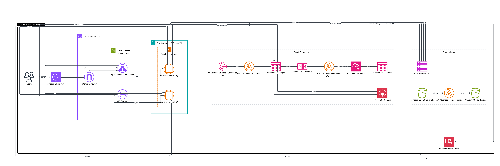

# SWCC-Project — Mini-Jira on AWS

A lightweight team task-management application (Mini-Jira) deployed on AWS with a highly available, multi-Availability-Zone architecture. Managers create and assign tasks; team members move them through a Kanban board, with image attachments, email notifications, and daily digests handled by an event-driven serverless layer.

## 🔗 Live Application

**https://d3m9i88eayfmui.cloudfront.net**

Clicking the link opens the live website directly — no additional configuration required. Traffic flows through Amazon CloudFront → Application Load Balancer → an Auto Scaling group of EC2 instances spread across two Availability Zones (`eu-central-1a` / `eu-central-1b`).

## 🏗️ Architecture

The diagram below illustrates the high-availability setup: Amazon CloudFront in front of an internet-facing Application Load Balancer, the EC2 backend running in an Auto Scaling group across private subnets in **two Availability Zones**, an event-driven serverless layer (EventBridge, Lambda, SNS, SQS, SES, CloudWatch), and a storage layer (DynamoDB, S3, Amazon Cognito). It is drawn using the official [AWS standard architecture icons](https://aws.amazon.com/architecture/icons/).

> Full-resolution source: **[docs/architecture-diagram.pdf](docs/architecture-diagram.pdf)**

## 🎬 Demo Video

▶️ **[Project Demo Video](https://youtu.be/ScqqxreiX1M)** 
